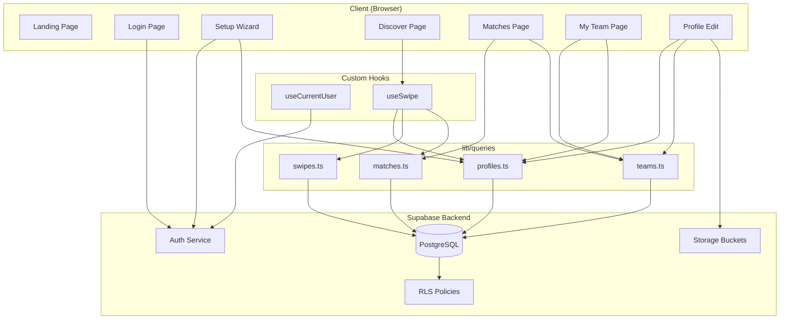

# TeamUp — Complete Project Review & Rating

> **Project:** TeamUp (graduation-mate)  
> **Stack:** Next.js 16 · React 19 · Supabase (Auth + Postgres + Storage) · Tailwind CSS 4 · TypeScript  
> **Purpose:** Tinder-style swipe matching for university students seeking graduation project teammates  
> **Reviewed:** May 2026

---

## 1. Product Concept & Originality

**Rating: 8.5 / 10**

This is a genuinely clever product idea. The problem is real — every university student struggles to find compatible graduation project teammates. The solution maps naturally to a Tinder-style swipe UX that students already understand.

### What's Strong
- **Clear value proposition**: "Find your team. Build something great." — immediately understood
- **Gated contacts** are a smart differentiator: contacts are only revealed when *both* matched students opt-in, preventing spam/abuse
- **Track-based matching** (AI, Data Science, Cybersecurity, Web Dev, Mobile Dev) reflects real CS department structures
- **Team awareness**: The app isn't just individual matching — it shows existing team composition, team needs, and lets students join established teams

### What Could Be Better
- No filtering/search in discover — students can't narrow by track, skills, or GPA
- No notification when someone swipes right on you — zero re-engagement
- Commitment level is collected but not editable or meaningfully used

---

## 2. Architecture & Tech Stack

**Rating: 7.5 / 10**

The tech choices are modern and appropriate for a university project of this scope.

### What's Strong
- **Next.js 16 + React 19**: Latest framework, using the App Router correctly
- **Supabase**: Excellent BaaS choice — Auth, Postgres, Storage, and RLS in one platform
- **`@supabase/ssr`**: Proper SSR-safe Supabase client (both [client.ts](file:///d:/Course/Projects/graduation-mate/lib/supabase/client.ts) and [server.ts](file:///d:/Course/Projects/graduation-mate/lib/supabase/server.ts))
- **`proxy.ts`**: Middleware handles auth redirects correctly — unauthenticated users go to `/login`, authenticated users skip `/login` and `/`
- **Clean separation**: `lib/queries/` for data access, `hooks/` for stateful logic, `components/` for UI, `types/` for contracts

### What Could Be Better
- **Dual auth state**: `useCurrentUser` maintains both localStorage cache AND Supabase auth sessions — architecturally awkward, adds ~100-300ms per page mount
- **No error boundary**: A single JS error crashes the entire app to a white screen
- **No React Context for auth**: Every protected page independently calls `getFreshUser()` — no shared auth state propagation
- **All data fetching is client-side**: No Server Components leveraged for initial data fetching

### Architecture Diagram



---

## 3. Code Organization & Quality

**Rating: 7.0 / 10**

### What's Strong
- **Consistent file structure**: Each route has its own `page.tsx`, components are properly separated into `ui/`, `discover/`, `profile/`
- **TypeScript throughout**: Types defined in [types/index.ts](file:///d:/Course/Projects/graduation-mate/types/index.ts) — `Profile`, `Swipe`, `Match`, `Team`, `TeamMember`
- **Query layer separation**: All Supabase operations in [lib/queries/](file:///d:/Course/Projects/graduation-mate/lib/queries) — not inline in components
- **Zod validation**: Form validation uses Zod schemas with `react-hook-form` integration
- **Utility functions**: Shared [cn()](file:///d:/Course/Projects/graduation-mate/lib/utils.ts#L6-L8), [getInitials()](file:///d:/Course/Projects/graduation-mate/lib/utils.ts#L10-L17), [getTrackBadge()](file:///d:/Course/Projects/graduation-mate/lib/utils.ts#L19-L37)

### What Could Be Better

| Issue | Files | Impact |
|-------|-------|--------|
| `getAvatarBg()` duplicated 4x with different algorithms | ProfileCard, TeammateAvatars, matches/page, my-team/page | Same person renders different colors on different pages |
| `TRACK_OPTIONS` duplicated in edit and setup | profile/edit/page.tsx, StepTrack.tsx | One update won't reflect in the other |
| `useState<any>` used for match/team data | matches/page.tsx, my-team/page.tsx | Type safety holes throughout |
| [profile/edit/page.tsx](file:///d:/Course/Projects/graduation-mate/app/profile/edit) is ~789 lines | Single file | Handles forms, avatar upload, track search, skill management, team CRUD, and logout |
| [matches/page.tsx](file:///d:/Course/Projects/graduation-mate/app/matches/page.tsx) is 437 lines | Single file | Contains business logic that belongs in query layer |
| `eslint-disable react-hooks/exhaustive-deps` on multiple hooks | discover, matches, BottomNav | Suppressed lint warnings indicate fragile dependency management |

### Code Metrics

| Metric | Value |
|--------|-------|
| Total TypeScript files | ~30 |
| Total lines of application code | ~3,500 |
| Number of components | 11 |
| Number of pages/routes | 8 |
| Number of custom hooks | 2 |
| Number of query modules | 4 |
| Number of DB migrations | 15 |
| Largest single file | my-team/page.tsx (~27KB) |

---

## 4. Security Posture

**Rating: 6.5 / 10**

The project went through a major security evolution (visible in the 15 migrations). The early version had plaintext passwords and no RLS. The current state is *significantly* improved but still has gaps.

### What's Been Fixed ✅
- [x] Plaintext passwords removed → Supabase Auth with email/password ([006_auth_migration.sql](file:///d:/Course/Projects/graduation-mate/supabase/migrations/006_auth_migration.sql))
- [x] RLS enabled on all 6 tables with proper policies
- [x] Contact data moved to separate `profile_contacts` table with match-gated RLS ([011_protect_profile_contacts.sql](file:///d:/Course/Projects/graduation-mate/supabase/migrations/011_protect_profile_contacts.sql))
- [x] `handle_new_user` REST access revoked ([010_secure_handle_new_user.sql](file:///d:/Course/Projects/graduation-mate/supabase/migrations/010_secure_handle_new_user.sql))
- [x] Team update/delete restricted to team members ([012_team_member_policies.sql](file:///d:/Course/Projects/graduation-mate/supabase/migrations/012_team_member_policies.sql))
- [x] Match uniqueness constraint added ([013_matches_unique_constraint.sql](file:///d:/Course/Projects/graduation-mate/supabase/migrations/013_matches_unique_constraint.sql))
- [x] Avatar storage is owner-scoped
- [x] RLS performance optimized with `(select auth.uid())` pattern ([015_rls_perf_optimization.sql](file:///d:/Course/Projects/graduation-mate/supabase/migrations/015_rls_perf_optimization.sql))

### Remaining Risks ⚠️
- `profiles` SELECT policy is `USING (true)` — any authenticated user can bulk-query all students' names, GPAs, departments, bios, avatars
- No email domain validation (`.edu` not enforced)
- No rate limiting on swipes — programmatic mass-swiping is possible
- No CSP or security headers in `next.config.ts`
- Leaked password protection disabled in Supabase Auth dashboard
- No account deletion flow (privacy concern)
- `LOGOUT_KEY` sentinel in localStorage could lock users in a weird state after browser crash

---

## 5. Database Design

**Rating: 7.5 / 10**

### Schema Quality

```mermaid
erDiagram
    profiles ||--o{ team_members : "belongs to"
    profiles ||--o| profile_contacts : "has"
    profiles ||--o{ swipes : "from"
    profiles ||--o{ swipes : "to"
    profiles ||--o{ matches : "profile1"
    profiles ||--o{ matches : "profile2"
    teams ||--o{ team_members : "contains"
    profiles }o--o| teams : "team_id FK"

    profiles {
        uuid id PK
        text full_name
        text department
        float gpa
        text track
        text[] skills
        text commitment_level
        text bio
        boolean is_available
        text team_status
        text looking_for_role
        text avatar_url
        uuid team_id FK
    }

    profile_contacts {
        uuid profile_id PK_FK
        text linkedin_url
        text whatsapp_number
    }

    teams {
        uuid id PK
        text name
        text status
        text project_description
        text[] project_technologies
        text[] roles_needed
    }

    swipes {
        uuid id PK
        uuid from_profile_id FK
        uuid to_profile_id FK
        text direction
    }

    matches {
        uuid id PK
        uuid profile1_id FK
        uuid profile2_id FK
        boolean profile1_contact_shared
        boolean profile2_contact_shared
    }
```

### What's Strong
- Clean relational design with proper foreign keys and cascading deletes
- Junction table `team_members` for many-to-many team membership
- Unique constraints on `swipes(from, to)` and computed match uniqueness
- Proper indexes on frequently queried columns
- Contact data separated into its own RLS-protected table

### What Could Be Better
- `profiles.team_id` denormalizes what `team_members` already provides (dual source of truth)
- Legacy `looking_for_role` text column still on `teams` table (superseded by `project_description`, `project_technologies`, `roles_needed`)
- No pagination support — discover fetches ALL available profiles
- 2 unused indexes: `idx_profiles_available`, `idx_profiles_track`

---

## 6. UI/UX Design

**Rating: 8.0 / 10**

The visual design is the project's strongest dimension. It genuinely looks like a polished consumer app, not a typical university assignment.

### What's Strong
- **Typography**: Instrument Serif for headings + Inter for body — beautiful pairing imported via Google Fonts
- **Glass morphism**: Custom `.liquid-glass` and `.light-glass` CSS utilities create a frosted-glass aesthetic
- **Atmospheric background**: Animated gradient pan (`bg-atmospheric`) adds life without distraction
- **Landing page**: Cinematic hero with background video, Nokia-font typing animation — playful and memorable
- **Login page**: Video with custom fade-in/fade-out loop via `requestAnimationFrame`, glassmorphic form card
- **Bottom navigation**: Clean 4-tab nav with Lucide icons, safe-area padding, blur backdrop
- **Profile cards**: Well-structured with avatar, name, GPA, track badge, commitment badge, skills, bio, team status, and teammate avatars
- **Skeleton loading states**: Every page has proper loading skeletons
- **Error states**: Dedicated error UI with "Try Again" button
- **Empty states**: Each page has contextual empty state messages

### What Could Be Better
- No dark mode support
- No responsive breakpoint testing mentioned — some components may clip on small phones (320px)
- No accessibility audit (no ARIA labels, no keyboard navigation, no screen reader testing)
- Video backgrounds are ~2-5MB with no poster fallback on landing page
- `prefers-reduced-motion` media query hides videos entirely (could show a static image instead)

---

## 7. Feature Completeness

**Rating: 7.0 / 10**

### Implemented Features

| Feature | Status | Quality |
|---------|--------|---------|
| 🏠 Landing page with animated hero | ✅ Complete | High — cinematic, memorable |
| 🔐 Email/password authentication | ✅ Complete | Good — uses Supabase Auth |
| 📝 5-step onboarding wizard | ✅ Complete | High — track search, skill combobox, team preferences |
| 🔍 Discover (swipe cards) | ✅ Complete | Good — Tinder-style with react-tinder-card |
| 💚 Right/Left swipe with mutual match detection | ✅ Complete | Good — correct logic |
| 🤝 Matches page with team info | ✅ Complete | Good — shows contact gating status |
| 🔒 Gated contact sharing (both must opt-in) | ✅ Complete | Excellent — unique differentiator |
| 👥 Team creation, joining, leaving | ✅ Complete | Functional but some UX confusion |
| 📸 Avatar upload to Supabase Storage | ✅ Complete | Good — owner-scoped |
| ✏️ Profile editing | ✅ Complete | Functional — very large single file |
| 📱 Bottom navigation | ✅ Complete | Clean — hides on public routes |
| 🔄 Reset swipe queue | ✅ Complete | Works but is a demo feature |

### Missing Features

| Feature | Impact |
|---------|--------|
| 🔍 Filter/search in discover | High — students want to filter by track/skills |
| 🔔 Match notifications | High — no way to know someone matched you |
| 🚪 Logout button | Fixed in recent sprint |
| 📊 Commitment level editing | Medium — shown but not editable |
| 🗑️ Account deletion | Medium — privacy concern |
| 📧 Email notifications | Medium — re-engagement |
| ↩️ Undo last swipe | Low — nice to have |
| 📱 PWA support | Low — would improve mobile experience |

---

## 8. Performance

**Rating: 5.5 / 10**

This is the weakest area and will become problematic at scale.

### Current Bottlenecks

| Issue | Impact | Location |
|-------|--------|----------|
| **N+1 queries on matches page** | Each match fires 2 extra queries (team + members). 18 matches = 36 extra queries | [matches/page.tsx](file:///d:/Course/Projects/graduation-mate/app/matches/page.tsx#L70-L104) |
| **Per-card teammate query in discover** | Each profile card fires a separate `team_members` query — up to 20 extra requests | [TeammateAvatars.tsx](file:///d:/Course/Projects/graduation-mate/components/profile/TeammateAvatars.tsx) |
| **`getFreshUser()` network roundtrip on every mount** | ~100-300ms added to every initial page render | [useCurrentUser.ts](file:///d:/Course/Projects/graduation-mate/hooks/useCurrentUser.ts#L63-L105) |
| **No pagination on discover** | Fetches ALL available profiles in one query | [profiles.ts](file:///d:/Course/Projects/graduation-mate/lib/queries/profiles.ts#L22-L71) |
| **Large background videos** | ~2-5MB each, no preloading strategy | Landing + login pages |
| **`TypingMessages` messages array in dependency** | Creates new reference every render | [page.tsx](file:///d:/Course/Projects/graduation-mate/app/page.tsx#L8) |

### Scaling Projections
- **50 users**: Works fine
- **200 users**: Matches page starts to lag (sequential team queries)
- **500+ users**: Discover query returns massive payload, swipes table grows to 250K rows

---

## 9. Testing & Error Handling

**Rating: 3.0 / 10**

### Testing
- **No test files found anywhere in the project** — no unit tests, no integration tests, no E2E tests
- No testing framework configured (no Jest, Vitest, Playwright, or Cypress)
- No CI/CD pipeline

### Error Handling
- Query errors are caught with try/catch and logged to console — decent but no user-facing error recovery beyond "Try Again"
- No global error boundary in `layout.tsx`
- `console.error` calls left in production code
- `console.info` debug logs left in logout path
- The `LOGOUT_KEY` sentinel is a creative but fragile workaround for a race condition

---

## 10. Documentation & Developer Experience

**Rating: 5.0 / 10**

### What Exists
- Default Next.js README (not customized)
- Two detailed audit documents: [product_audit.md](file:///d:/Course/Projects/graduation-mate/product_audit.md) and [theStata@5.54.md](file:///d:/Course/Projects/graduation-mate/theStata@5.54.md) — these are exceptionally thorough
- [UiFix.md](file:///d:/Course/Projects/graduation-mate/UiFix.md) tracking UI issues
- [AGENTS.md](file:///d:/Course/Projects/graduation-mate/AGENTS.md) with basic guidelines
- 15 SQL migration files with comments

### What's Missing
- No customized README with setup instructions, environment variables, or architecture overview
- No API documentation
- No component documentation or storybook
- No contribution guidelines
- No `.env.example` file (only `.env.local`)
- No deployment documentation

---

## 11. Overall Rating

| Dimension | Weight | Score | Weighted |
|-----------|--------|-------|----------|
| 🎯 Product Concept & Originality | 15% | 8.5 | 1.28 |
| 🏗️ Architecture & Tech Stack | 15% | 7.5 | 1.13 |
| 📦 Code Organization & Quality | 15% | 7.0 | 1.05 |
| 🔒 Security Posture | 10% | 6.5 | 0.65 |
| 🗄️ Database Design | 10% | 7.5 | 0.75 |
| 🎨 UI/UX Design | 10% | 8.0 | 0.80 |
| ✅ Feature Completeness | 10% | 7.0 | 0.70 |
| ⚡ Performance | 5% | 5.5 | 0.28 |
| 🧪 Testing & Error Handling | 5% | 3.0 | 0.15 |
| 📖 Documentation | 5% | 5.0 | 0.25 |
| **Overall** | **100%** | | **7.0** |

---

# Overall Score: 7.0 / 10

> **This is a strong university graduation project.** The product idea is original and practical, the UI design is genuinely premium, and the security posture evolved significantly through iterative audits. The codebase is clean and well-organized for a project of this scope. The main gaps — no tests, N+1 query patterns, and some remaining security holes — are typical of student projects and don't invalidate the achievement.

### Biggest Strengths
1. **Product vision** — real problem, clever solution, gated contacts is a genuine differentiator
2. **Visual polish** — looks like a real consumer app, not a homework assignment
3. **Security evolution** — went from plaintext passwords to proper auth + RLS + contact isolation across 15 migrations
4. **Onboarding wizard** — 5-step flow with track search, skill combobox, team preferences is well thought out
5. **Contact gating** — mutual opt-in before revealing WhatsApp/LinkedIn is a trust-building feature

### Biggest Weaknesses
1. **Zero tests** — no unit, integration, or E2E tests
2. **N+1 query explosion** — matches page fires 36+ queries for 18 matches
3. **No pagination** — discover loads all profiles at once
4. **Dual auth state** — localStorage + Supabase sessions add complexity and latency
5. **Large files** — profile/edit (789 lines), my-team (27KB) need decomposition

---

## Recommended Top 5 Improvements

| Priority | What | Impact | Effort |
|----------|------|--------|--------|
| 1 | Add basic test suite (Vitest + React Testing Library) | Demonstrates engineering discipline; catches regressions | Medium |
| 2 | Fix N+1 on matches page — prefetch team data in the query | Eliminates 36+ extra DB calls per page load | Low |
| 3 | Add global Error Boundary to `layout.tsx` | Prevents white screen crashes | Low |
| 4 | Extract shared utilities (getAvatarBg, TRACK_OPTIONS) | Eliminates duplication bugs | Low |
| 5 | Add discover filters (track, skills) | The #1 feature users would want | Medium |
